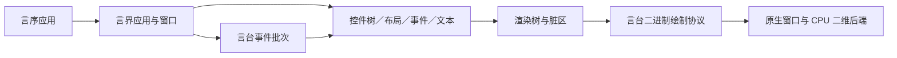

# 言界架构

## 边界

言界不导入 Win32、AppKit、Cocoa、Wayland、X11、Direct2D、CoreGraphics、Metal，也不保存
平台指针。唯一系统边界是言台公开的 ABI v2 值、长期资源、事件批次和二进制绘制帧。

## 模块

| 模块 | 实际职责 |
| --- | --- |
| `src/主.yx` | 应用、窗口、控件基类、容器和常用控件 |
| `核心/几何.yx` | 矩形、边距、约束、交并和命中 |
| `核心/脏区.yx` | 脏区裁剪、合并和全量退化 |
| `核心/状态.yx` | 状态、绑定、动画与语义节点 |
| `核心/错误.yx` | 言界／言台／言据错误归一化 |
| `布局/算法.yx` | 行、列、堆叠和网格的测量与排列 |
| `事件/路由.yx` | 捕获、目标、冒泡、焦点与快捷键 |
| `文本/文档.yx` | Unicode 文档、选区、历史与 IME 组合态 |
| `样式/配置.yx` | 默认主题、继承、状态覆盖、言据／JSON |
| `渲染/命令.yx` | 保留渲染树和言台绘制帧编码 |

## 一帧的路径

1. 言台把一批平台事件交给`应用.处理批次`。
2. 窗口按窗口编号接收事件；连续指针事件已在言台合并。
3. 指针事件先命中测试，再按根到目标捕获、目标处理、目标到根冒泡。
4. 状态改变调用`使无效`或`请求布局`，脏区管理器合并逻辑像素矩形。
5. `需要重绘`时才测量／排列必要的树，随后建立保留渲染树。
6. 布局或语义变脏时，以稳定控件编号向言台提交完整无障碍树；相同快照由言台去重。
7. 渲染树按脏区裁剪展开为结构化命令，并由言台一次编码和提交二进制帧。

每个绘制原语不会单独跨 ABI；上层也看不到任何原生窗口或渲染句柄。

## 输入与焦点

控件树逆序命中最上层可见控件。按下控件可请求指针捕获，保证拖动期间事件仍到原目标。
每窗有独立焦点管理器、快捷键表和 IME 光标区域。键盘事件只表达导航与命令；文字插入只
来自`文本输入`或`IME组合提交`，不会从按键名猜测 Unicode 文字。

言台发回`无障碍焦点请求`时，窗口先提交尚未同步的语义变化，再核对请求携带的树修订，
按稳定编号重新遍历当前控件树。只有仍可见、启用、可聚焦的当前控件会获得焦点；成功后
立即提交新修订，旧树请求不会落到已经关闭或身份变化的控件。

`无障碍动作请求`经过同一修订和编号复核后才交给目标控件。按钮点击和输入框设置值、
UTF-8 字节边界选区、复制、粘贴各自重验状态与参数；处理成功后再提交最终快照。畸形、
越界、旧修订或控件未声明的动作不会降级成普通事件。

## 生命周期

应用拥有窗口；窗口拥有控件树、路由器、焦点和脏区。控件关闭会递归关闭子树、解除父子
关系并清理焦点／捕获。图片资源默认由调用者拥有，也可用控件配置的`拥有资源`转移所有权。
原生资源最终仍按言台的父子资源规则释放。

每个控件创建时取得稳定正整数编号；语义快照直接复用该编号，并明确输出可见、启用、
可聚焦、焦点状态和声明操作。编号只在控件所属窗口的语义树中使用，不作为原生句柄。
